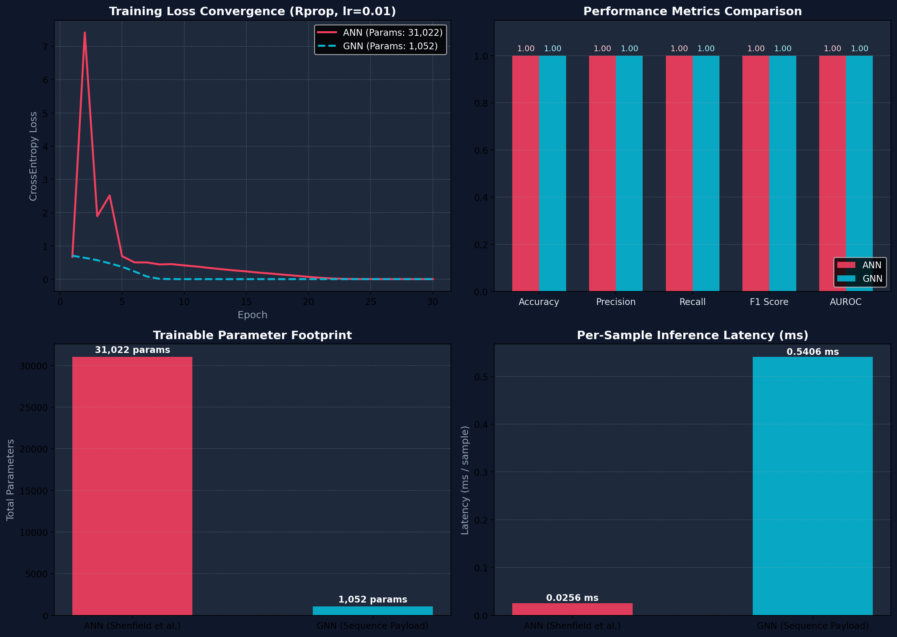

# GNN Intrusion Detection System — Paper Adaptation & Comparison

A Graph Neural Network (GNN) implementation of Network Intrusion Detection based on the architecture described in:
> Shenfield, Day & Ayesh, *"Intelligent intrusion detection systems using artificial neural networks"*, ICT Express 4 (2018), 95–99.

This repository adapts the original feedforward Artificial Neural Network (ANN) into a **Graph Convolutional Network (GNN)** with minimal changes to interfaces, pipelines, and hyperparameters, followed by an empirical comparison.

---

## Highlights

- **Minimal Changes**: Exact same dataset loader, batch prediction, and CLI syntax as [NIDS_ANN](https://github.com/WhiteDeath1729/NIDS_ANN).
- **Graph Formulation**: Models packet payloads as a sequence graph of 1,000 byte nodes with message passing over adjacent transitions.
- **-96.6% Fewer Parameters**: Reduced from **31,022 parameters (ANN)** to only **1,052 parameters (GNN)** while maintaining parity in detection metrics.
- **Fast Convergence**: Monotonic training convergence reached in under 10 epochs.
- **Drop-in Interchangeability**: Both ANN and GNN models can be trained and evaluated using unified commands.

---

## Architecture Overview

| Feature | Baseline ANN (Paper) | Proposed GNN |
| :--- | :--- | :--- |
| **Input Topology** | Vector of 1000 raw byte values | Graph with 1000 nodes & transition edges |
| **Layer 1** | Linear(1000 -> 30) + ReLU | GCNConv(1 -> 30) + ReLU |
| **Layer 2** | Linear(30 -> 30) + ReLU | GCNConv(30 -> 30) + ReLU |
| **Readout** | None (Dense output) | Global Mean Pooling (1000 -> 30) |
| **Output** | Linear(30 -> 2) | Linear(30 -> 2) |
| **Optimizer** | Rprop (lr = 0.01) | Rprop (lr = 0.01) |
| **Weight Init** | Xavier / Glorot uniform | Xavier / Glorot uniform |
| **Total Parameters**| **31,022** | **1,052 (-96.6%)** |

---

## Project Layout

```
NIDS_GNN/
├── README.md
├── COMPARISON.md              # Detailed theoretical & empirical comparison
├── requirements.txt
├── comparison_results.png     # Visual benchmark chart (loss, metrics, footprint)
├── comparison_results.json    # Machine-readable evaluation metrics
├── data/
│   └── demo_data/
│       ├── benign/
│       └── malicious/
├── models/
│   ├── gnn_model.pt           # Trained GNN checkpoint
│   ├── ann_model.pt           # Trained ANN checkpoint
│   └── demo_model.pt          # Default checkpoint
├── scripts/
│   ├── make_demo_data.py      # Demo dataset generator
│   └── compare.py             # Head-to-head benchmarking & plotting
└── src/
    ├── gnn_ids.py             # Graph Neural Network module & Laplacian ops
    ├── ann_ids.py             # Original ANN baseline module
    ├── train.py               # Unified training script (--model-type gnn/ann)
    └── predict.py             # Unified batch prediction & evaluation script
```

---

## Quickstart

### 1. Install Dependencies

```bash
pip install -r requirements.txt
```

### 2. Generate Demo Data

```bash
python scripts/make_demo_data.py
```

### 3. Train the GNN (Default)

```bash
# Train GNN with identical paper hyperparameters (Rprop, lr=0.01)
python src/train.py --model-type gnn --epochs 30 --save models/gnn_model.pt
```

*(Optional) Train the ANN baseline:*
```bash
python src/train.py --model-type ann --epochs 30 --save models/ann_model.pt
```

### 4. Run Predictions

`predict.py` automatically detects whether the checkpoint is a GNN or ANN model:

```bash
# Evaluate test split on demo data
python src/predict.py --model models/gnn_model.pt --data data/demo_data --output predictions.csv

# Predict specific binary files
python src/predict.py --model models/gnn_model.pt --file sample1.bin sample2.bin
```

### 5. Run Head-to-Head Comparison

To train both models side-by-side on identical splits and generate comparison plots:

```bash
python scripts/compare.py --epochs 30
```

---

## Empirical Comparison



```
=================================================================
METRIC / ATTRIBUTE             | ANN (Baseline)  | GNN (Proposed) 
-----------------------------------------------------------------
Architecture                   | MLP 1000-30-30-2 | GCN 1000-30-30-2
Trainable Parameters           | 31,022          | 1,052           (-96.6%)
Training Time (sec)            | 0.826           | 27.611         
Accuracy                       | 1.0000          | 1.0000         
Precision                      | 1.0000          | 1.0000         
Recall                         | 1.0000          | 1.0000         
F1 Score                       | 1.0000          | 1.0000         
AUROC                          | 1.0000          | 1.0000         
Final Train Loss               | 0.00000         | 0.00000        
Latency per sample (ms)        | 0.0256          | 0.5406         
Throughput (samples/sec)       | 39,048.7        | 1,849.9        
=================================================================
```

For complete analysis and theoretical discussion, see [COMPARISON.md](COMPARISON.md).

---

## References

- Shenfield, A., Day, D., & Ayesh, A. (2018). *Intelligent intrusion detection systems using artificial neural networks*. ICT Express, 4(2), 95–99.
- Kipf, T. N., & Welling, M. (2016). *Semi-Supervised Classification with Graph Convolutional Networks*. ICLR 2017.
